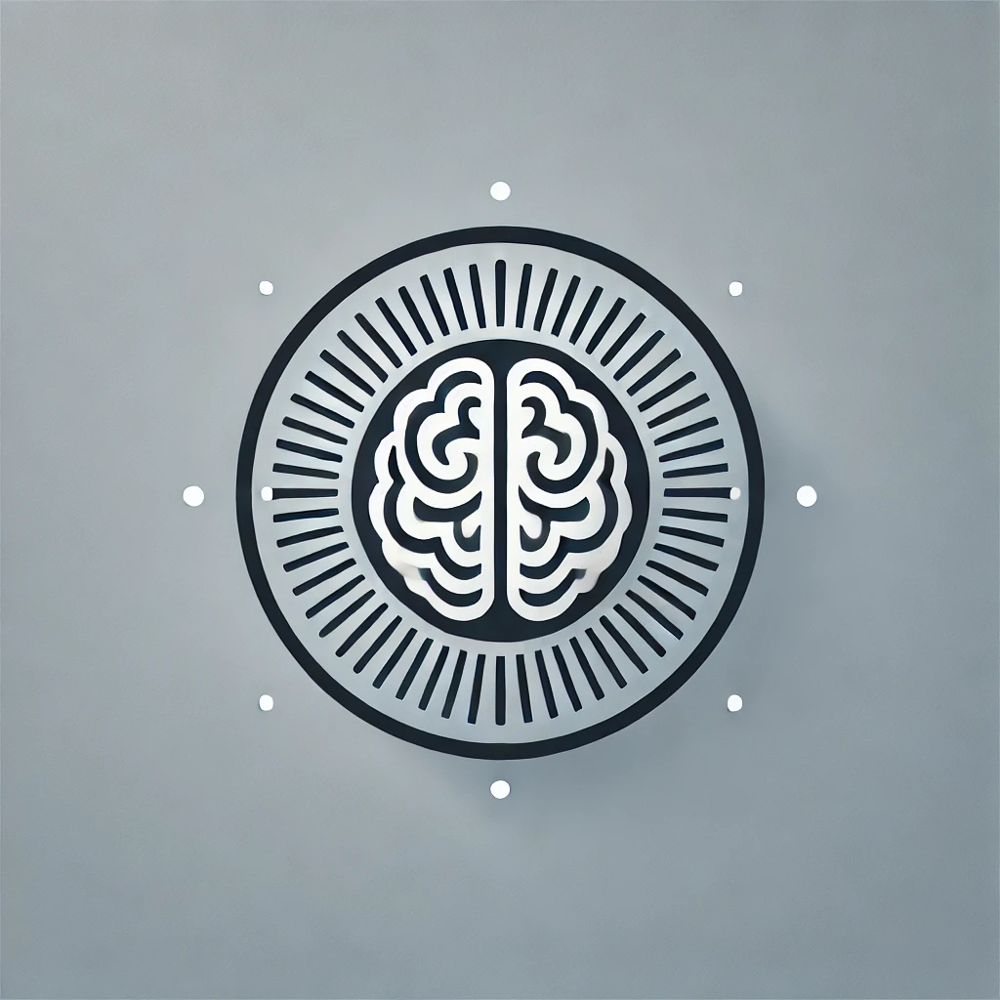

# FocusBuddy - Dein persönlicher Pomodoro Timer mit Bewegungsmonitoring

## Inhaltsverzeichnis

- [Über die App](#über-die-app)
- [Funktionen](#funktionen)
- [Wie es funktioniert](#wie-es-funktioniert)
- [Voraussetzungen](#voraussetzungen)

## Über die App

FocusBuddy ist eine innovative Pomodoro-Timer-App, die dir hilft, deine Produktivität zu steigern und gleichzeitig deine körperliche Aktivität zu überwachen. Durch die Integration von Bewegungsdaten sorgt FocusBuddy dafür, dass du nicht nur fokussiert bleibst, sondern auch regelmäßig Pausen einlegst, um dich zu bewegen und deine Gesundheit zu fördern.

## Funktionen

- **Pomodoro-Timer:** Effektive Zeitmanagement-Technik zur Steigerung der Produktivität.
- **Aufgabenverwaltung:** Verwalte deine Aufgaben direkt in der App.
- **Bewegungsmonitoring:** Überwacht deine körperliche Aktivität während der Arbeits- und Pausenzeiten.
- **Fokus-Status:** Zeigt dir deinen aktuellen Fokus-Status basierend auf deiner Aktivität an.
- **Audio-Benachrichtigungen:** Erhalte akustische Erinnerungen zur Unterstützung deines Fokus und deiner Bewegung.
- **Dynamische Anpassungen:** Passe die Pomodoro- und Pausenzeiten nach deinen Bedürfnissen an.

## Wie es funktioniert

FocusBuddy nutzt die Pomodoro-Technik, um deine Arbeits- und Pausenzeiten zu strukturieren:

1. **Arbeitsphase:** Stelle den Pomodoro-Timer ein und beginne mit einer konzentrierten Arbeitsphase (standardmäßig 25 Minuten).
2. **Bewegungsmonitoring:** Während der Arbeitsphase überwacht ein angeschlossenes eSense-Gerät deine Bewegungen. Wenn du dich zu wenig bewegst, wird dein Fokus-Status entsprechend angepasst.
   - **Fokussiert:** Du bist aktiv und konzentriert.
   - **Abgelenkt:** Deine Bewegungen deuten auf Ablenkung hin.
3. **Pause:** Nach der Arbeitsphase folgt eine Pause (standardmäßig 5 Minuten). Auch in der Pause wird deine Bewegung überwacht:
   - **Gute Bewegung!** Wenn du dich ausreichend bewegst.
   - **Mehr bewegen!** Wenn du dich zu wenig bewegst.
4. **Audio-Benachrichtigungen:** Erhalte Benachrichtigungen, um dich daran zu erinnern, fokussiert zu bleiben oder dich zu bewegen.

## Voraussetzungen

- **eSense-Gerät:** Ein kompatibles eSense-Gerät zur Bewegungsüberwachung.